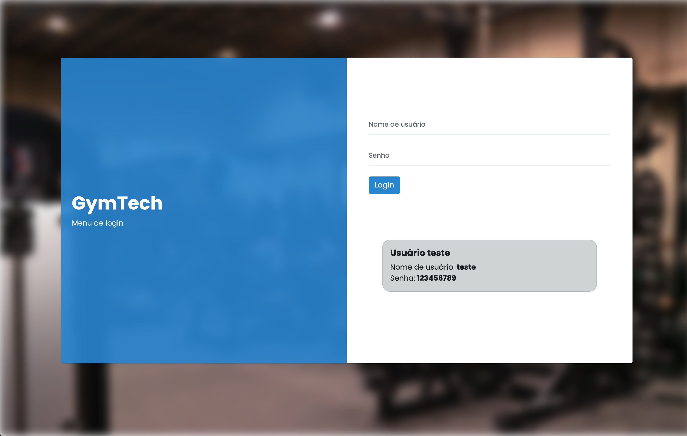
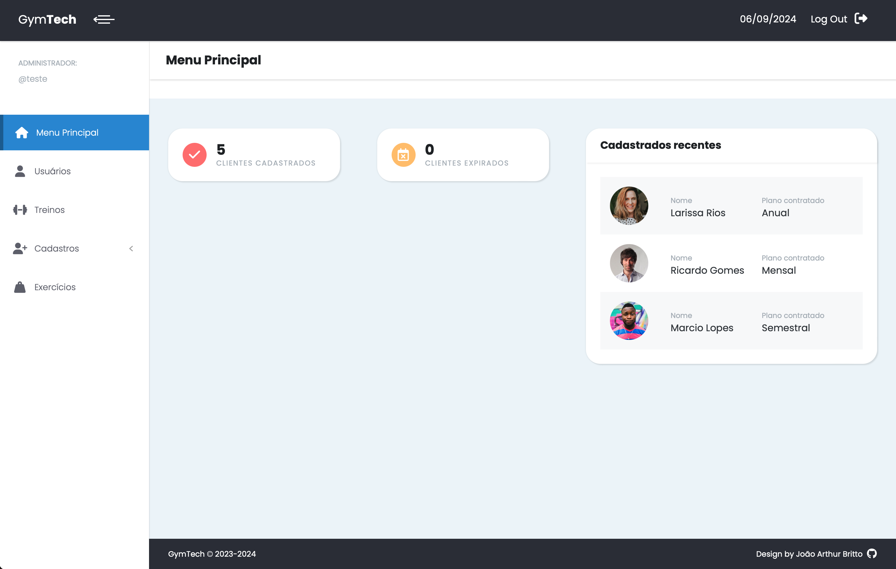
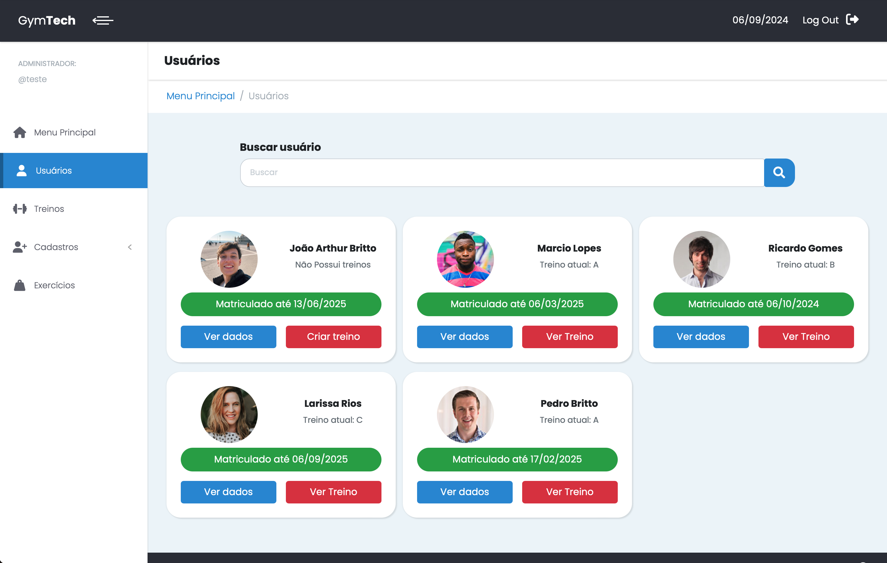
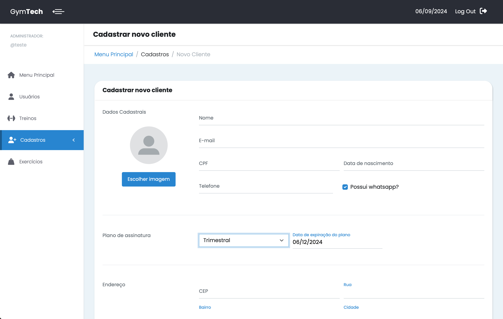
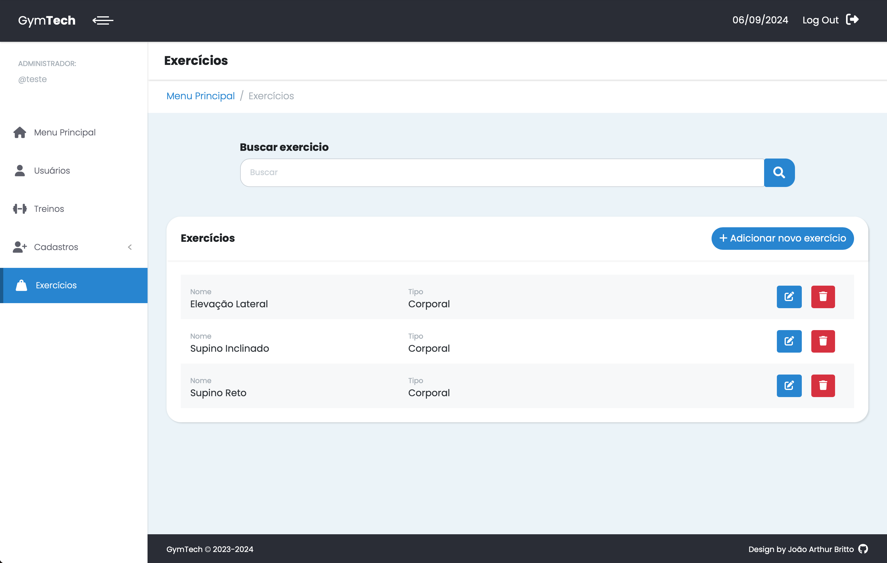

# GymTech 

### Bem-vindo ao GymTech - Web-App de Gerenciamento de Academia
Bem-vindo ao GymTech, um aplicativo web construído em Django para gerenciar academias. 
O GymTech oferece recursos de cadastro de clientes e administradores, criação de treinos 
personalizados e cadastro de exercícios. Este projeto, desenvolvido por mim, João Arthur Britto, 
tem como objetivo aprimorar meu portfólio de desenvolvedor e 
servir como um meio de aprendizado contínuo do framework web Django.

## Funcionalidades Principais

<ol>
    <li> 
        <strong>Cadastro de Clientes e Administradores:</strong> Registre tanto os clientes quanto os 
        administradores da academia. Os administradores terão acesso a recursos exclusivos de gerenciamento.
    </li>
     
    <li> 
        <strong>Treinos Personalizados:</strong> Crie treinos personalizados para cada cliente com base em suas 
        necessidades e objetivos. Você pode escolher entre uma variedade de exercícios disponíveis.
    </li>
     
    <li> 
        <strong>Cadastro de Exercícios:</strong> Mantenha uma lista atualizada dos exercícios disponíveis na 
        academia. Isso ajudará na criação dos treinos personalizados.
    </li>
</ol>

## Tecnologias utilizadas

 

## Acesso ao Aplicativo
O GymTech já está disponível online! Você pode acessá-lo pelo link: <a href="gymtech.cloud">gymtech.cloud</a> 

Utilize as seguintes credenciais para fazer login como usuário de teste:

<ul>
    <li><strong>Nome de Usuário:</strong> teste</li>
    <li><strong>Senha:</strong> 123456789</li>
</ul>

## Desafios encontrados
Durante o desenvolvimento deste projeto, enfrentei diversos desafios, incluindo a integração de tecnologias variadas, como o Django, SQLite3 e Bootstrap.

Simultâneamente ao desenvolvimento desse projeto, também estava estudando e aprendendo sobre o Django, então muitas vezes precisei refatorar o código quando descobria uma funcionalidade nova do Django que melhoraria o codigo e o deixaria mais eficiente.

A criação de uma interface amigável também foi um desafio importante, visando tornar o aplicativo intuitivo para os administradores da academia e, ao mesmo tempo, fornecer informações relevantes.

## Capturas de tela
Algumas partes do aplicativo:

    
    
    
    
    
    

## Contribuição
Se desejar contribuir para este projeto, fique à vontade para fazer um fork do repositório e enviar suas sugestões através de pull requests.
 
## Sobre
Olá! Meu nome é João Arthur Britto, e sou o desenvolvedor por trás do GymTech. 
Este projeto é parte do meu processo contínuo de aprendizado do framework Django, além de servir como uma adição valiosa ao meu portfólio.

## Contato

Se você tiver dúvidas ou precisar de suporte, sinta-se à vontade para entrar em contato comigo pelo email joaoabritto.dev@gmail.com. Estou sempre em busca de melhorias e oportunidades de aprendizado. 